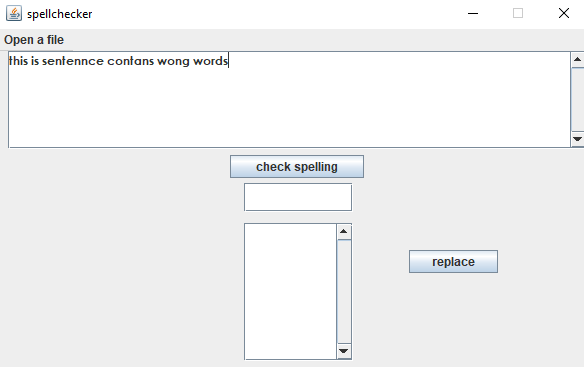
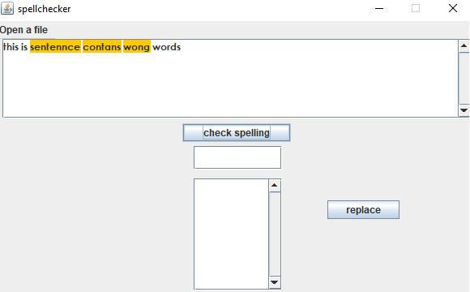
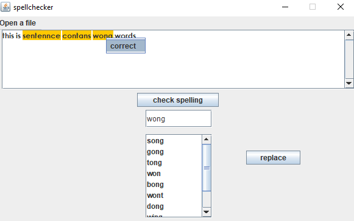
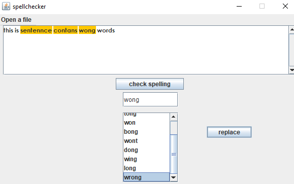
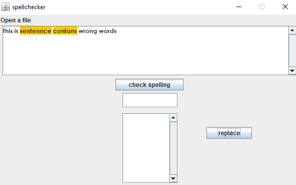

<<<<<<< HEAD
# spell_checker 
  this is a java application for checking words spelling and providing the correct words for the wrong ones and correcting them
# spell_checker
=======
# spell_checker
  

      
this is a java application for checking words spelling and providing the correct words for the wrong ones and correcting them.

      <ul>
        <li>using trie to build a dictionnary of words</li>
       <li>levenshtien algorithm combined with trie for spelling suggestions</li>
        <li> Window Builder for building the GUI</li>
      <ul>
   

  

    <h3>writing in the text area and pressing the "check spelling" button to check the text.<h3>
      
  

  

    <h3>After checking the text the misspelled words will be highlited<h3>
       
  

  

    <h3>right click on one of the highlited words and click "correct" to search for similar(close) correct words<h3>
       
  

  

    <h3>select a correct from the list of correct words and press replace, all occurences will be replaced<h3>
       
        
  

>>>>>>> 81e1fb9... Update README.md
